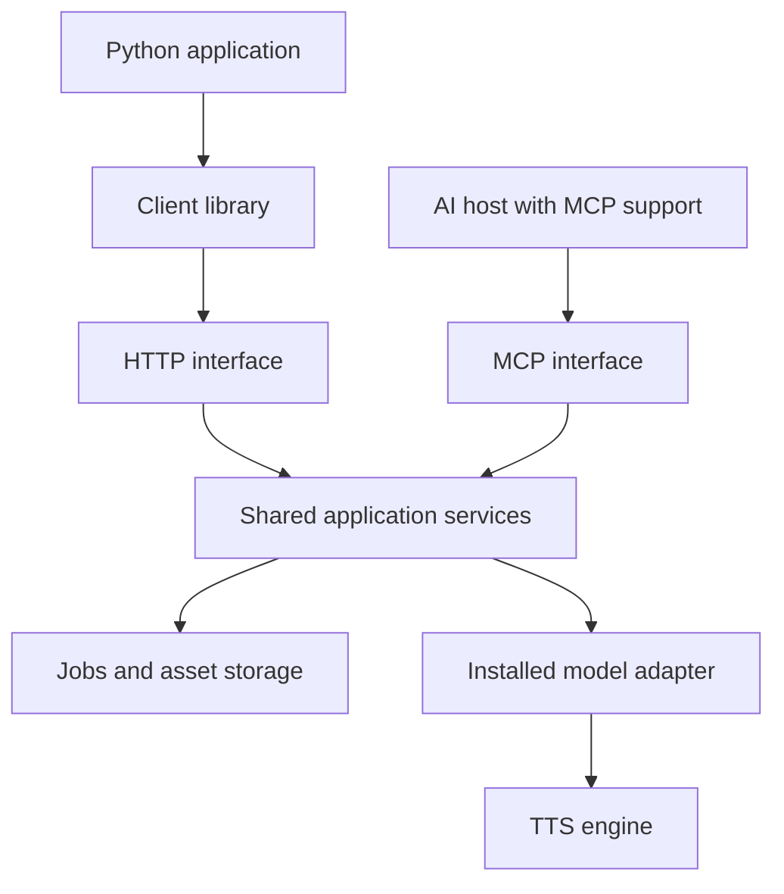

# Architecture and ownership

[Back to index](README.md)

Implementation ownership: [shared server](https://github.com/lambdawalker/python.tts.api.server) and [Python client](https://github.com/lambdawalker/python.tts.api.client). Engine adapters remain in the model repositories.

## Components

| Component | Owns | Does not own |
| --- | --- | --- |
| Shared server | HTTP routes, MCP tools, application services, validation, model registry, assets, voices, job persistence and scheduling | Semantic rewriting of caller content |
| Model adapter | Model loading, inference, model profile definitions, native parameter mapping, guidance, model-specific validation | HTTP endpoints, MCP transport, independent job storage |
| Python client | Typed HTTP access, uploads, downloads, job handles, progress reconnection, structured errors | Model inference or MCP hosting |
| Calling application or AI agent | Discovering capabilities, reading guidance, selecting voices, authoring text/tags/instructions | Assuming all engines support the same features |

## Deployment

Each engine runs in its own environment with compatible Python, Torch, CUDA, and model dependencies. The server core must not force all engines into one dependency environment or import their frameworks at client import time.

Each deployment exposes `/v1/...` for HTTP and, when enabled, `/mcp` for MCP. These are application deployment paths, not claims that MCP requires a particular URL.

HTTP and MCP call the same application services in process. MCP must not invoke the public HTTP API internally when both interfaces share that process. The optional future standalone bridge would instead use the client library.

Initially use one inference worker per configured device unless an adapter explicitly declares tested concurrency. Admission limits prevent unbounded queue growth.

## Interchangeability

Interchangeability guarantees stable operation names, request envelopes, job semantics, and errors. It does not guarantee identical audio, the same native tags, interchangeable embeddings, shared asset IDs, or universal feature support.

When the target deployment or model changes, callers refresh capabilities and guidance and resolve voices again. A configured default profile allows basic requests without hardcoding a checkpoint. Jobs record the resolved profile and revisions.

## Voice identity

Voice IDs and asset IDs are deployment-local. Aliases such as `narrator` are explicitly configured mappings; identical aliases do not prove identical voice identity.

A future voice export/import bundle should preserve reference audio, transcript, language, and metadata. Embeddings must be recreated for the destination model. No hidden default-voice substitution is allowed for an unavailable requested voice.

## Implementation boundaries

The server package contains reusable contracts, services, HTTP/MCP interfaces, persistence, and adapter interfaces. Each model repository supplies an adapter and startup configuration. The client is independently installable with no GPU dependencies.

Contract changes must update these documents, generated schemas, both interfaces, and conformance examples together.
